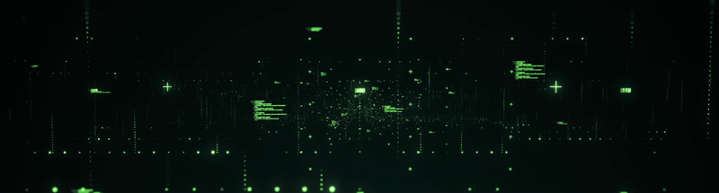

<!--  -->
<!-- ## 🌻 &nbsp;Hello there, I am Olena -->
## 👩🏼‍💻 &nbsp;About Me
Hello, I am Olena, and I have a unique combination of technical experience and creativity to offer the world of technology.
I have earned a background in project management, business analysis, and no-code development and have been creating ideas into life and bridging the gap between business needs and technical solutions for several years. 

Then I wanted more and became a developer. 
Now, with skills in Ruby on Rails, JavaScript, and other technologies, I build full-stack applications that are functional and user-oriented. 
My approach is a mix of deep business process understanding with precision from a developer's point of view, hence allowing me to create solutions that make an impact.

I’m passionate about clean code, solving problems, and constantly learning. Whether it’s collaborating on a new product or improving existing systems, I’m ready to bring value, creativity, and dedication to your team. Let’s build something amazing together!
<!-- &nbsp; -->
## 🛠 &nbsp;Languages & Tools

 
  
  
  
  
  
  
  

 
  
  
  

 
  
  
  

<!-- &nbsp; -->
## ⚙️ &nbsp; Let’s create something amazing together!
📩 hulakova.olena@gmail.com

<!-- ## ⚙️ &nbsp;Stats

 -->

<!-- 

 -->
<!--
**aprioriO/apriorio** is a ✨ _special_ ✨ repository because its `README.md` (this file) appears on your GitHub profile.

Here are some ideas to get you started:

- 🔭 I’m currently working on ...
- 🌱 I’m currently learning ...
- 👯 I’m looking to collaborate on ...
- 🤔 I’m looking for help with ...
- 💬 Ask me about ...
- 📫 How to reach me: ...
- 😄 Pronouns: ...
- ⚡ Fun fact: ...
-->
